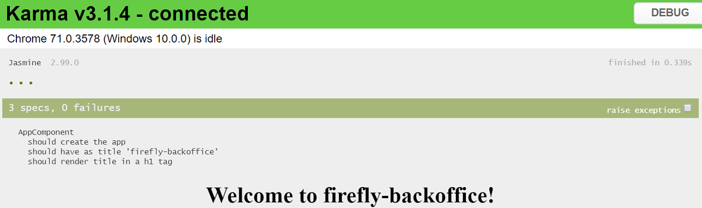
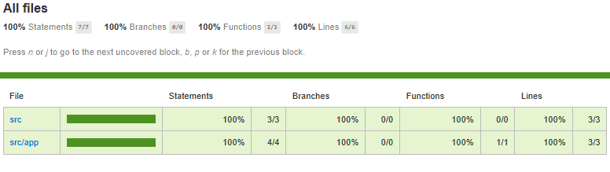
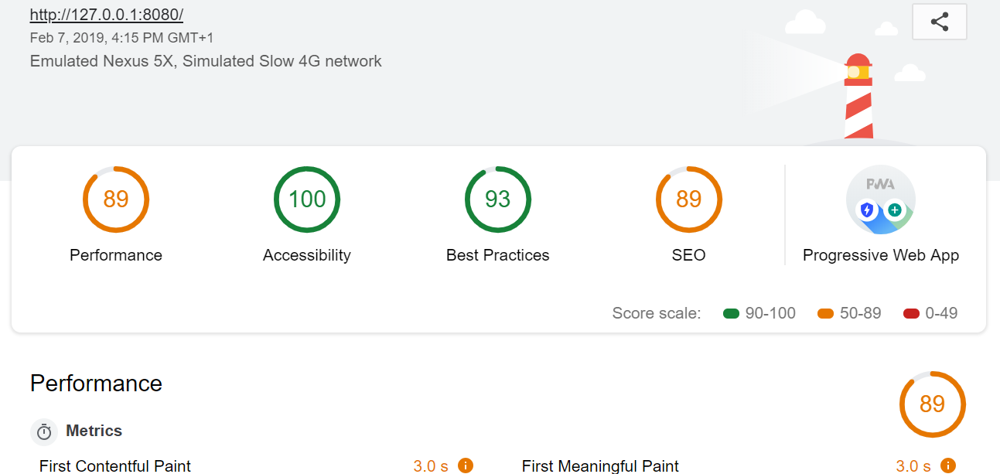
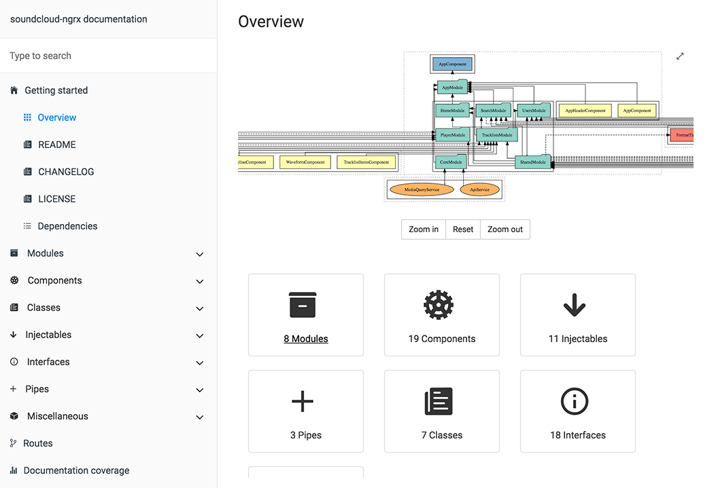

# Trangular

Backoffice es un proyecto core que incluirá otros subproyectos, por cada sección.

&nbsp;

# Tecnologías
---
---


This project was generated with [Angular CLI](https://github.com/angular/angular-cli) version 7.2.3.

&nbsp;

# Comandos
---
---

## Levantar servidor
---

Cuando levantamos la aplicación, podemos levantar el proyecto con todos los subproyectos, o un subproyecto solamente.

Podrás visualizarlo en http://localhost:4200

```javascript
// Levantar el proyecto con todo
ng serve

// Levantar un subproyecto
ng serve --project bcc
```

En este proyecto tenemos configurado el package.json para que puedas levantarlo. Debemos ejecutar desde la terminal:

```javascript
// Levantar la aplicación general
npm run start

//Levantar la subaplicación bcc
npm run start:bcc
```

&nbsp;
## Generadores de Código
---

### Subproyectos
---

```javascript
ng generate application app1 –-routing
```

&nbsp;
### Componentes, pipes, services...
---
Para generar componentes en algún subproyecto, deberemos indicarlo al ejectuar el comando con el CLI.

```javascript
ng generate component view1 --project=bcc
```

Estos mismos comandos los podremos usar para generar las distintas posibilidades que tiene angular.

`ng generate directive|pipe|service|class|guard|interface|enum|module`.

&nbsp;
## Tests
---

### Test unitarios
---
Para lanzar los test unitarios, podemos lanzar los del proyecto completo, o solo de cada uno de los subproyectos.

```javascript
npm run test

npm run test:bcc

npm run test:promo
```


Podemos ejecutar los tests para poder ver en directo cuales nos fallan, o lanzarlo para generar la covertura del código y ver cuántos nos faltan por desarrollar.

```javascript
// Ejecuta por debajo: ng test
npm run test

// Nos genera el reporte de covertura de código
// Ejecuta por debajo: ng test --no-watch --code-coverage
npm run test:cov
```

Generaremos dos tipos de reportes:
- Coverage: Nos indicará cuánto código tenemos cubierto con test unitarios. Lo podremos encontrar en /test/unit/coverage


- Unitarios: Tendremos un resumen de los test unitarios y su estado. Lo podremos encontrar en /test/unit/report/units.html


&nbsp;
### Lint
---
Este test nos valida nuestro código typescript/javascript, su formato, complejidad cicomática, etc.

Los comandos que tenemos son:
```javascript
// Nos revisará nuestro código y nos mostrará por la terminal los errores a corregir
npm run lint

// Nos revisará nuestro código y se encuentra un error nos crearé un archivo lint.json con los errores en la carpeta test. Esta carpeta ya debería estar creada.
npm run lint:report
```

&nbsp;
### Lighthouse
---
Lighthouse es una herramienta automatizada de código abierto diseñada para mejorar la calidad de tus apps web.
Podemos usar su funcionalidad con el depurador de chrome o a través de la línea de comandos.

Nos medirá:
- Performance
- Accesibility
- Best Practices
- SEO

Para lanzar los test de esta herramienta, sería con:
```javascript
npm run lh
```
Nos creará en la carpeta test, dos reportes html y json.


&nbsp;
## Build
---
Podremos Compilar tanto el proyecto conjuntamente, como cada subproyecto individualmente.

Para ello se podría realizar:

```javascript
// Compilar todo conjunto
ng build --prod

// Compilar solo un proyecto
ng build --prod --project:name-project
```

&nbsp;
## Running end-to-end tests
---
Run `ng e2e` to execute the end-to-end tests via [Protractor](http://www.protractortest.org/).

&nbsp;
## Documentación técnica
---
Generaremos la documentación técnica con la librería Compodoc. Esta librería recorrerá nuestro proyecto y nos generará cierto contenido dinámicamente e integrará los comentarios que hayamos añadido.



Para lanzar los scripts:
```javascript
// Generaremos la documentación en la carpeta documentation
// Ejectuta por debajo: compodoc -p src/tsconfig.app.json --theme Postmark -V --hideGenerator
npm run doc

// Generaremos la documentación y nos levantará un servidor para que podamos ver la documentación en el navegador: http://127.0.0.1:8080
// Ejecuta por debajo: compodoc -p src/tsconfig.app.json --theme Postmark --hideGenerator -s
npm run doc:live
```

&nbsp;
Deberemos documentar que hacen las clases, funciones, variables... Existen diferentes plugins de Visual Studio o nuestro IDE, que nos facilitará el trabajo.

```javascript
import { Component } from '@angular/core';

/**
 * Creación de documentación de ejemplo
 *
 */
@Component({
  selector: 'app-root',
  templateUrl: './app.component.html',
  styleUrls: ['./app.component.scss']
})
export class AppComponent {
  /**
   * Ejemplo documentar título
   *
   */
  public title = 'trangular';
}
```

[Más info](https://compodoc.app/)

&nbsp;

# Guías
---
---

## Git-Flow
---
En este proyecto trabajamos con bitbucket y con el sistema de gitflow.

Trabajaremos con las ramas:
- Nuevas funcionalidades: [feature/]
- Releases: [release/]
- Revisiones: [hotfix/]
- Versión tag: [] v

Los comandos básicos que necesitaremos para añadir contenido son:
```javscript
// Empezar un nuevo feature
git-flow feature start init-readme
```

```javscript
// Ver listado de ramas feature
git-flow feature
```

```javscript
// Finalizar la rama feature
git-flow feature finish init-readme
```

En el caso de que quisieras hacer un merge, sin los comandos de gitflow usa la propiedad --no-ff para no perder la información.

```javascript
git merge --no-ff feature/init-readme
```

Si quieres más información y guías:
- http://aprendegit.com/git-flow-la-rama-develop-y-uso-de-feature-branches/
- http://howto.gandasoftwarefactory.com/desarrollo-software/2016/como-gestionar-ramas-con-git-flow-20160718/
- http://danielkummer.github.io/git-flow-cheatsheet/index.es_ES.html
- https://nvie.com/files/Git-branching-model.pdf

&nbsp;
## Git Submodules
---
Trabajar con submodulos, nos va a permitir clonar asíncronamente cada subproyecto que tengamos en nuestra aplicación Angular.

Cuando clonemos el proyecto:
```javascript
git clone url
```

Primero debebemos añadir el submodulo, e indicarle el nombre que tendrá.
```javascript
git submodule add urlSubProject nameSubProject
```

Necesitaremos luego, entrar en cada carpeta del submodulo y inicializarlo
```javascript
git submodule init
git submodule update
```

Para ver quien ha hecho los últimos cambios en un submódulo.
```javascript
git log -1 nameSubProject
```
Estamos indicando al final que submódulo es el que queremos observar.

Cuando se trabaje en una rama del submodulo, es necesario crear definir la rama antes:
```javascript
git checkout -b trabajo
```

Hay que tener cuidado de los conflictos que pueden ocurrir estando trabajando en ramas diferentes en los submodulos y en el módulo principal.

&nbsp;
## Configuración de la aplicación
---
Para definir la configuración o environment en Angular, nos trae por efecto los ficheros de environment. Esto nos permite generar un proyecto para cada entorno.

Para esta arquitectura, hemos optado por no usar este sistema, y utilizar la otra opción que nos facilita angular, para generar un solo proyecto y por propiedades asignar la configuración tanto del entorno como de otras propiedades.

En estos momentos, hay un fichero temporal assets/env/config.json del cual obtendríamos dicha configuración. Dicho fichero, deberá ser sustituido y/o eliminado durante el pipeline. Este contenido con las versión de despliegue, se obtendrá de un repositorio privado, evitando así tener dichas variables asignadas dentro del código frontend.

&nbsp;
## PWA
---
Añadida la librería de PWA para aplicaciones Angular.
Cuando se vayan añadiendo aplicaciones deberíamos:
- Configurar cache
- Configurar actualización PWA
- Configurar Push notifications
- Actualización de los iconos

https://angular.io/guide/service-worker-intro


&nbsp;
## Further help
---
To get more help on the Angular CLI use `ng help` or go check out the [Angular CLI README](https://github.com/angular/angular-cli/blob/master/README.md).
